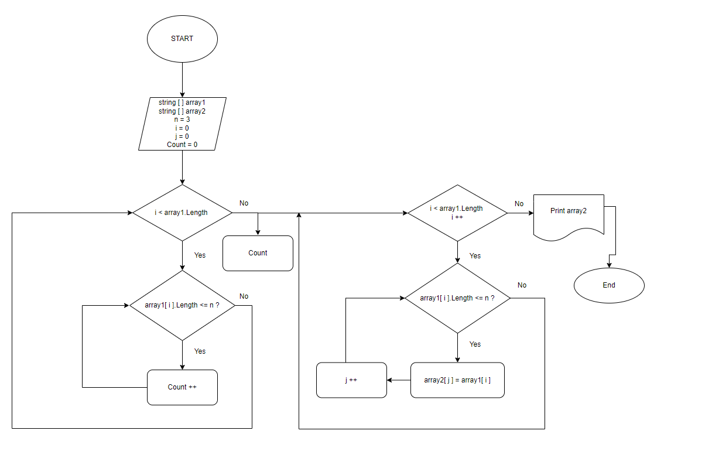

**Задача:**

Написать программу, которая из имеющегося массива строк формирует массив из строк, длина которых меньше либо равна 3 символа. Первоначальный массив можно ввести с клавиатуры, либо задать на старте выполнения алгоритма. При решении не рекомендуется пользоваться коллекциями, лучше обойтись исключительно массивами.

**Описание решения:**
1.	Создаем исходный массив и просим заполнить его с клавиатуры -> ввести 5 значений через пробел длиной от 1 до 10 символов
2.	Создаем новый массив
3.	Делаем перебор 5 значений исходного массива
4.	Проверяем условие: длина значения меньше или равна трем? 
5.	Если строка удовлетворяет условию данное значение кладем в новый массив
6.	Повторяем пункт 3 и 4 пока не пройдем все значения исходного массива
7.	Возвращаем новый заполненный массив 

**Блок-схема:**

